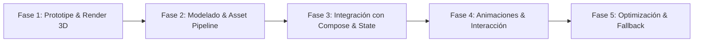

# 🗺️ Plan de Integración: Mapa 3D Animado (Estilo Google Maps / Low-Poly RPG)

> **Estado actual (MVP):** `CampusMapView` muestra el mapa 2.5D local
> completamente offline. Usa `posX`/`posY` sin modificar Room, conserva la
> navegación y permite seleccionar los puntos de interés. La integración de
> un mapa geográfico real queda para una fase posterior.

Este documento de planeación detalla la estrategia de diseño, arquitectura, evaluación técnica y hoja de ruta para evolucionar el mapa 2D actual de **Campus Quest** hacia una **experiencia 3D inmersiva, interactiva y animada**.

---

## 🎯 Objetivos de la Propuesta

1. **Inmersión y Estética:** Transformar la vista 2D simple en un mapa 3D interactivo con tilt/rotación, sombras dinámicas y marcadores 3D flotantes/animados (misiones, pines de interés, personaje/avatar).
2. **Estilo Animado / Low-Poly:** Mantener la esencia de videojuego (estilo RPG / Low-Poly / Stylized Shaders) en lugar de un renderizado realista plano.
3. **Compatibilidad e Integración:** Mantener la coherencia con el flujo actual de misiones, escáner QR, persistencia con Room y navegabilidad en Jetpack Compose.

---

## 🛠️ Alternativas de Implementación Técnica

| Criterio | Opción A: Google Maps 3D Vector Maps (Maps SDK v4) | Opción B: Sceneview / Filament (Engine 3D Nativo en Android) | Opción C: Mapbox Maps SDK v11 (Custom 3D Models & Camera) |
|---|---|---|---|
| **Renderizado 3D** | Edificios 3D fijos, cámara 3D (tilt, bearing, zoom), marcadores vectoriales. | Modelos 3D personalizados (`.gltf`/`.glb`), renderizado Low-Poly cel-shaded, shaders animados. | Capas 3D con modelos GLTF, cámara 3D fluida, terrenos tridimensionales. |
| **Estilo Visual** | Realista / Satelital / Vectorial estándar de Google. | **Altamente personalizable** (Pixel/Low-Poly/RPG 3D animado estilo Zelda/Pokemon). | Stylized Vector Maps con modelos 3D encima. |
| **Offline (RF-20)** | Requiere conexión constante a internet + API Key comercial. | **100 % Offline** (Carga modelos `.glb` desde `assets/`). | Requiere descarga de tiles y API Key. |
| **Rendimiento** | Optimizado por Google Play Services. | Muy alto rendimiento (OpenGL ES / Vulkan mediante Filament de Google). | Alto rendimiento pero consumo de memoria medio/alto. |
| **Recomendación** | Para un mapa real basando en coordenadas GPS reales. | **(RECOMENDADA para Campus Quest)** Conserva la filosofía offline y la estética gamer. | Opción intermedia si se requiere integración híbrida GPS/3D. |

---

## 🏗️ Arquitectura de Integración (Opción B: Sceneview / Filament)

```
        UI Layer (Jetpack Compose)
 ┌──────────────────────────────────────┐
 │             HomeScreen               │
 └──────────────────┬───────────────────┘
                    │
                    ▼
 ┌──────────────────────────────────────┐
 │     Campus3DMapView (SceneView)      │  <── Contenedor AndroidView en Compose
 └──────────────────┬───────────────────┘
                    │
   ┌────────────────┴────────────────┐
   ▼                                 ▼
┌─────────────────────────┐  ┌───────────────────────────┐
│ Camera Controller (3D)  │  │   3D Markers & Entities   │
│ Tilt: 45° | Orbit/Pan   │  │ Pins animados, Monedas,   │
└─────────────────────────┘  │ Edificios 3D (.glb)       │
                             └─────────────┬─────────────┘
                                           │
                                           ▼
                             ┌───────────────────────────┐
                             │  Room Database (Puntos)   │
                             │ Posiciones X, Y, Z / Lat  │
                             └───────────────────────────┘
```

---

## 🎨 Características Interactivas y Animaciones

1. **Marcadores de Misión Flotantes (3D Pins):**
   - Animación de levitación (*bobbing*) y rotación continua sobre los Puntos de Interés.
   - Partículas o destellos (*sparks*) para misiones sugeridas o activas.
   - Cambio de color según estado (Gris: bloqueada, Dorado: activa, Verde: completada).

2. **Cámara Animada / Cinemática:**
   - **Vista general:** Ángulo de 45° (*Isométrico 3D*).
   - **Transición al seleccionar:** Al tocar un punto de interés o misión sugerida, la cámara realiza un *smooth fly-to* (transición fluida de zoom y rotación hacia el objetivo).

3. **Elementos de Entorno Animados:**
   - Nubes flotantes en la capa superior con transparencia.
   - Árboles y césped 3D con leve animación de viento.
   - Avatar / Personaje estilizado marcando la posición actual del estudiante.

---

## 📋 Fases de Desarrollo y Hoja de Ruta



### **Fase 1: Prototipado del Renderizador 3D**
- [x] Crear una primera capa 2.5D offline sin dependencias externas.
- [x] Mantener `posX`/`posY` y el toque de marcadores compatible con Room.
- [ ] Evaluar dependencias de `io.github.sceneview:sceneview:2.2.1` (basado en Filament).
- [ ] Crear el composable `Campus3DMapView` encapsulando la escena 3D dentro de `AndroidView`.
- [ ] Configurar la iluminación ambiental y direccional (sombras suaves estilo cel-shading).

### **Fase 2: Modelado y Assets 3D**
- [ ] Diseñar/exportar en Blender los modelos `.glb`:
  - `pin_mision.glb` (Insignia / Marcador 3D)
  - `campus_map_base.glb` (Plano base 3D del campus con edificios simplificados)
  - `avatar_player.glb` (Indicador de posición del jugador)

### **Fase 3: Vinculación con Datos Existentes (`Room`)**
- [ ] Mapear la coordenada relativa `(posX, posY)` de `PuntoInteresEntity` a coordenadas tridimensionales de la escena `(X, 0.0f, Z)`.
- [ ] Conectar los eventos de tap en los objetos 3D con el `onMisionClick` para abrir el detalle de la misión.

### **Fase 4: Animaciones e Interacción UI**
- [ ] Implementar el ciclo de animación en el render loop (rotación de pins, partículas).
- [ ] Implementar gestos de navegación: rotación con dos dedos, zoom suave (*pinch to zoom*) y pan.

### **Fase 5: Optimización y Fallback**
- [ ] Ajustar el nivel de detalle (LOD) para garantizar **60 FPS** en dispositivos de gama media/baja (API 29+).
- [ ] Incluir un selector en **Ajustes** para alternar entre *Mapa 2D Retro (Pixel Art)* y *Mapa 3D Animado*, garantizando compatibilidad total.

---

> [!TIP]
> **Recomendación de Diseño:** Al conservar la opción del mapa 2D Pixel Art y permitir alternar a 3D Animado, se cumple con la entrega académica sin romper el rendimiento ni la funcionalidad offline original.
